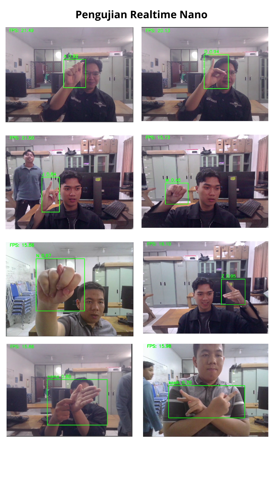
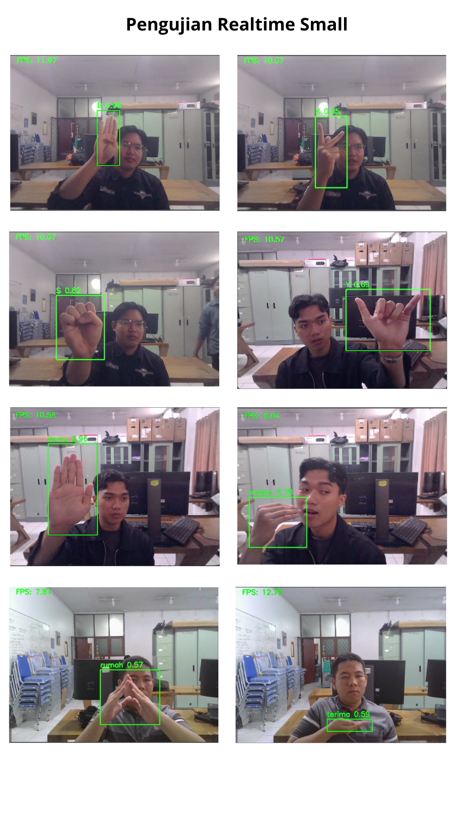
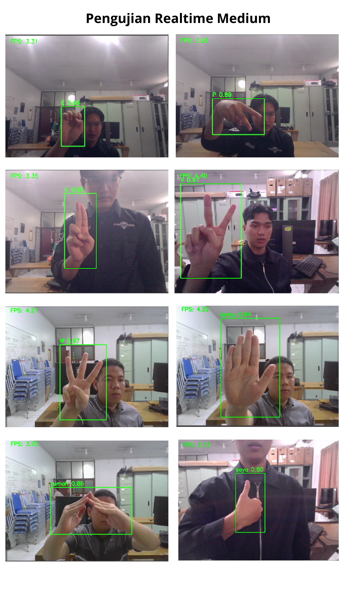
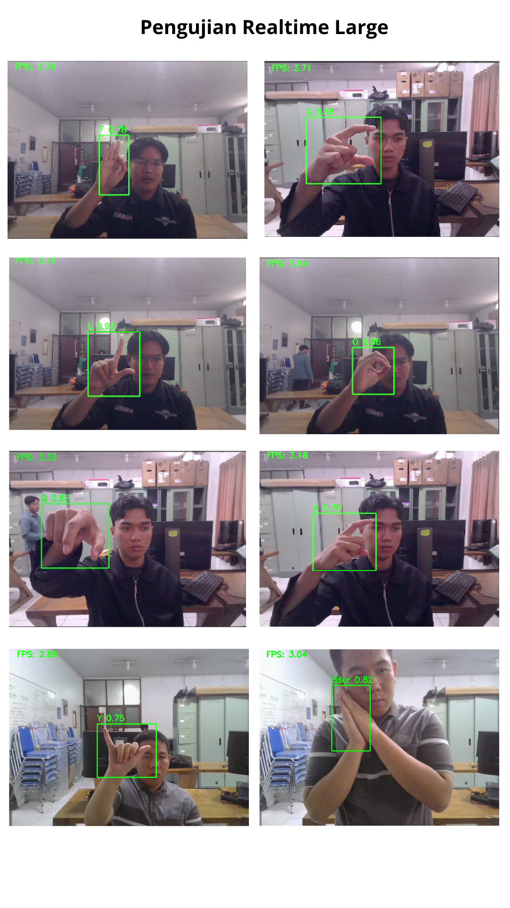
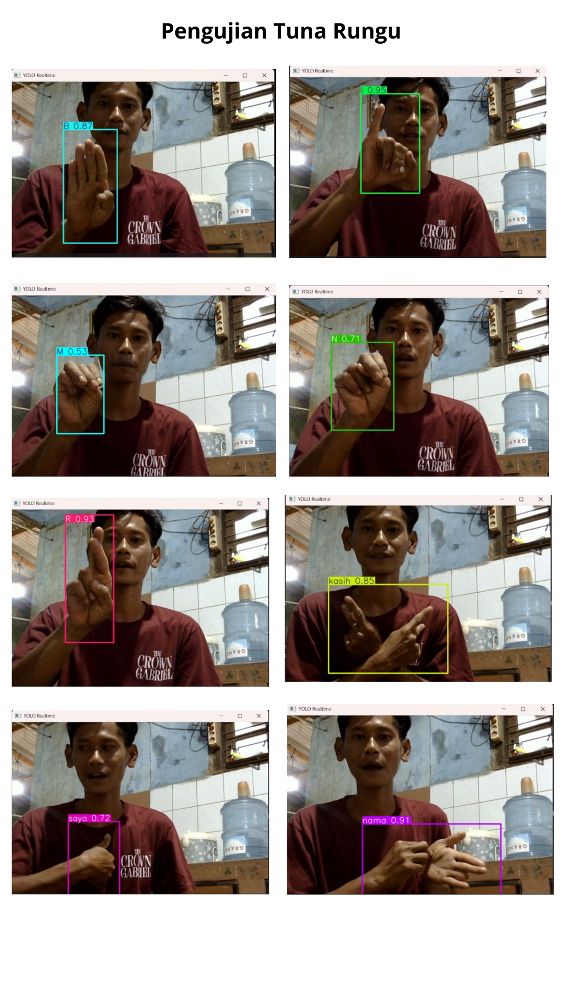

# Proyek Pengenalan Bahasa Isyarat Berbasis YOLOv11

## Deskripsi Proyek
Proyek ini bertujuan untuk membangun dan mengevaluasi sistem **pengenalan bahasa isyarat** berbasis visi komputer dengan memanfaatkan **YOLOv11** sebagai model deteksi objek. Sistem dirancang untuk mengenali gesture tangan secara **real-time** dari citra atau video, yang kemudian dapat digunakan sebagai media pembelajaran bahasa isyarat.

Penelitian ini melakukan eksperimen pada beberapa varian YOLOv11 (nano, small, medium, dan large) untuk menganalisis **trade-off antara akurasi dan kecepatan**, di mana hasil pengujian menunjukkan bahwa model **YOLOv11 nano** memberikan performa paling optimal pada skenario real-time.

---

## Struktur Folder Proyek

```text
├── modeling/
├── Pengujian/
│   ├── hasil pengujian model.csv
│   ├── pengujian.ipynb
│   ├── test.py
│   └── test2.py
│
└── preprocessing/
    ├── aug.py
    ├── boundingBox.py
    ├── boundingBox2.py
    ├── convert_to_yolo.py
    ├── distribusi.ipynb
    ├── distribusi2.ipynb
    ├── Mediapipe1.py
    ├── mediapipe2.py
    ├── pembagian.py
    ├── resize.py
    ├── ubahNama.py
    ├── ubahNama2.py
    └── validasi.py
```
## Penjelasan Folder dan File

### 1. Folder `Pengujian`

Folder ini berisi seluruh proses **evaluasi dan pengujian model YOLOv11** untuk mengukur performa deteksi gesture bahasa isyarat.

- **`hasil pengujian model.csv`**  
  Berisi rekap hasil evaluasi model, seperti nilai akurasi, precision, recall, mAP, serta kecepatan inferensi untuk setiap varian YOLOv11 (nano, small, medium, dan large).

- **`pengujian.ipynb`**  
  Notebook yang digunakan untuk melakukan analisis hasil pengujian, visualisasi performa model, serta perbandingan kinerja antar varian YOLOv11.

- **`test.py`**  
  Script Python untuk melakukan pengujian model menggunakan data uji, baik pada citra maupun video, guna mengevaluasi kemampuan deteksi gesture.

- **`test2.py`**  
  Script pengujian lanjutan atau alternatif yang digunakan untuk skenario berbeda, seperti pengujian real-time atau konfigurasi parameter tertentu.

---

### 2. Folder `preprocessing`

Folder ini berisi seluruh tahapan **pra-pemrosesan dataset** sebelum digunakan pada proses pelatihan model YOLO.

- **`aug.py`**  
  Script untuk melakukan augmentasi data, seperti rotasi, flipping, dan scaling, guna meningkatkan variasi dataset dan mengurangi overfitting.

- **`boundingBox.py`**  
  Digunakan untuk pembuatan atau penyesuaian bounding box pada citra gesture tangan.

- **`boundingBox2.py`**  
  Versi alternatif dari proses pembuatan bounding box, digunakan untuk eksperimen atau pendekatan yang berbeda.

- **`convert_to_yolo.py`**  
  Script untuk mengonversi anotasi dataset ke format YOLO (`.txt`) yang berisi label kelas dan koordinat bounding box.

- **`distribusi.ipynb`**  
  Notebook untuk menganalisis distribusi data pada setiap kelas gesture.

- **`distribusi2.ipynb`**  
  Notebook lanjutan untuk analisis distribusi data dengan pendekatan atau visualisasi yang berbeda.

- **`Mediapipe1.py`**  
  Digunakan untuk mengekstraksi landmark tangan menggunakan MediaPipe sebagai dasar anotasi atau pemfilteran gesture.

- **`mediapipe2.py`**  
  Versi pengembangan atau alternatif dari proses ekstraksi landmark tangan menggunakan MediaPipe.

- **`pembagian.py`**  
  Script untuk membagi dataset menjadi data latih, data validasi, dan data uji.

- **`resize.py`**  
  Digunakan untuk mengubah ukuran citra agar sesuai dengan dimensi input model YOLO.

- **`ubahNama.py`**  
  Script untuk melakukan standarisasi penamaan file dataset.

- **`ubahNama2.py`**  
  Versi alternatif atau lanjutan dari proses penamaan file dataset.

- **`validasi.py`**  
  Digunakan untuk melakukan validasi dataset, memastikan kesesuaian jumlah file, label, dan struktur folder sebelum pelatihan model.


## Hasil Pengujian










